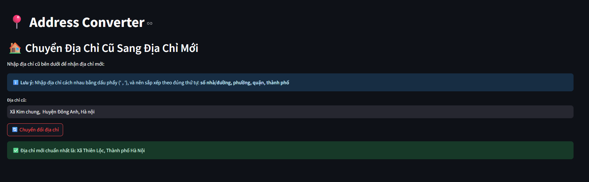

# 📍 Vietnam Address Converter

Convert **3-level Vietnamese addresses** into the **2-level administrative format**.  
Includes a **Python package** and an interactive **Streamlit demo**.

---

## ✨ Features
- Convert old → new addresses automatically.  
- Handle common province/district renaming in Vietnam.  
- Single address or batch file processing.  
- Simple web demo built with Streamlit.  

---

## 🛠 Installation

```bash
# Clone repo
git clone https://github.com/dunp7/vietnamese-address-converter-2025.git
cd vietnamese-address-converter-2025

# Install dependencies
pip install -r requirements.txt
```

---

## 🚀 Usage

### 1. Python API
```python
from src.converter import get_new_address
import pandas as pd

query_address = "Phương Mai, Đống Đa, Hà Nội"
mapping_data = pd.read_json('data/ward_mappings.json')

newadd, _ = get_new_address(query_address, mapping_data)
print(newadd) # [{'score': 3, 'new_address': 'Phường Kim Liên, Thành phố Hà Nội'}]
```

### 2. Run Streamlit Demo
```bash
streamlit run app.py
```

---

## 🎨 Streamlit Demo

**Screenshot:**  
  

---

## 📊 Data
The data is based on the [Vietnam Address Database](https://github.com/quangtam/vietnam-address-database) by [Vu Quang Tam](https://github.com/quangtam).


---

## 📜 License
MIT License – feel free to use and modify.  
